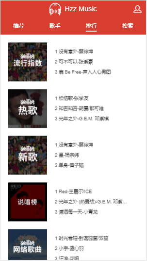
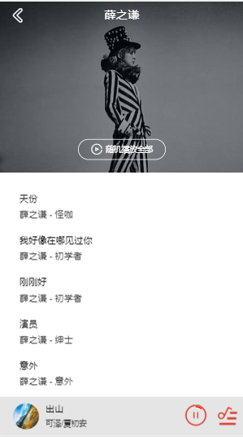

# 音乐播放应用

**该项目参考慕课网黄奕的vue-music项目仿写，有不懂的地方自己一点一点扒线上的源码
地址是[http://ustbhuangyi.com/music/] 有需要的同学可以参考下**


### 技术栈

`axios  vuex  good-storage js-base64 jsonp lyric-parser better-scroll `

- 采用better-scroll进行滚动处理

- 路由采用按需加载提高页面加载速度

- 采用jsonp进行跨域处理，在webpack.dev.conf.js中进行请求的refer和host的修改（本地服务生效）

- vuex对歌曲列表信息数据统一管理，封装scroll组件，confirm组件，loading组件

- 采用stylus进行页面样式绘制，定义样式函数，统一字体大小项目主要颜色

- 采用vue的mixin 混入功能对小播放器出现时调整页面布局

- good-storage进行本地数据的缓存处理

### 项目页面展示

`首页页面/歌手页面`


`排行/搜索页面`





`播放/min播放页面`




`个人中心/搜索列表页面`


## Build Setup

``` bash
# install dependencies
npm install

# serve with hot reload at localhost:8080
npm run dev

# build for production with minification
npm run build

# build for production and view the bundle analyzer report
npm run build --report

# run unit tests
npm run unit

# run e2e tests
npm run e2e

# run all tests
npm test
```

For a detailed explanation on how things work, check out the [guide](http://vuejs-templates.github.io/webpack/) and [docs for vue-loader](http://vuejs.github.io/vue-loader).
# hzz-music


[]: http://ustbhuangyi.com/music/
